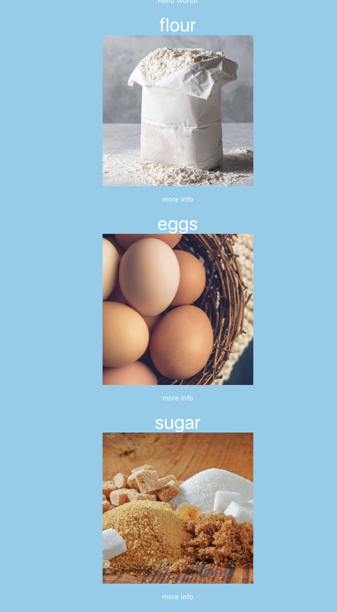

# Recipe Meal Planner

I love cooking and baking so I made a recipe meal planner app. This way I can keep all my recipes in one place whilst also keeping track of which items I have in my pantry. It takes a way the stress of finding recipes and allows me to not have to exhast all my creativity on planning my weakly meals.

Users can signup and the login or logout. Users can view all the ingredients in the database and add them to their pantry. The can view their pantry and modify the quantity of the ingredient. Users can search for recipes using the edemam api with the ingredients they have in their pantry. They can favourite the recipes they like and add the ingredients that recipe needs.

I used ruby on rails to build my backend and react.js to build the frontend. I used bootstrap for the css framework and implemented a recipe finder API from edemam [edemam API](https://www.edamam.com).
I started building a react native app as an alternate frontend.
I installed a react heart library to favourite my recipes and a react calendar to plan my meals
